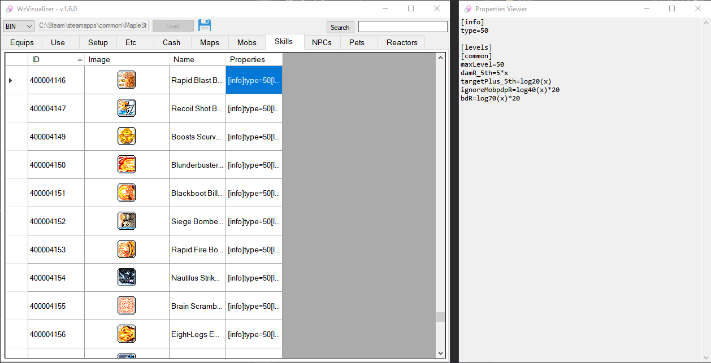
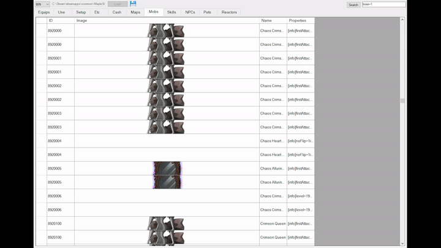
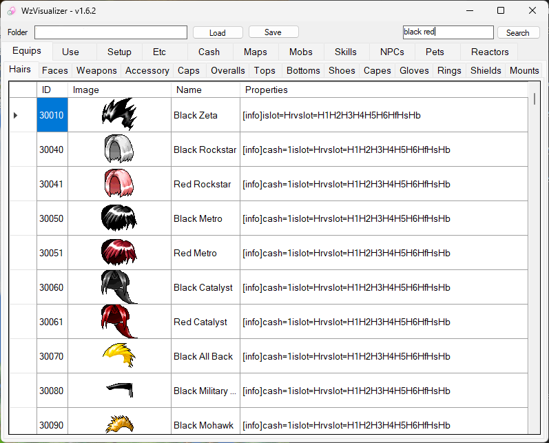

# WzVisualizer
A MapleStory .wz visualizer written in C# -- Also known as a GM Handtool!   

# Features
- Content inside individually selected cells have their contents automatically copied to the clipboard
    - Click and drag to select cells, rows and/or columns and use `CTRL+C` to copy
    - Also works for images!
- Left click the save button to save loaded data to binary files
    - Allows faster loading as you no longer have to wait for .wz decryption
- Supports `.img` and `.wz` files
- Right click the save button (floppy icon) to save all images
- Hold `SHIFT` when loading or saving to process all tabs (**Warning**: High memory usage!)
    - This also works if you want to extract every loaded image in every tab
---

Double click a `Properties` cell to view data

Double click an image to auto adjust column and row size to match the image

Search box uses each word (separated by spaces) as indivudual search queries
