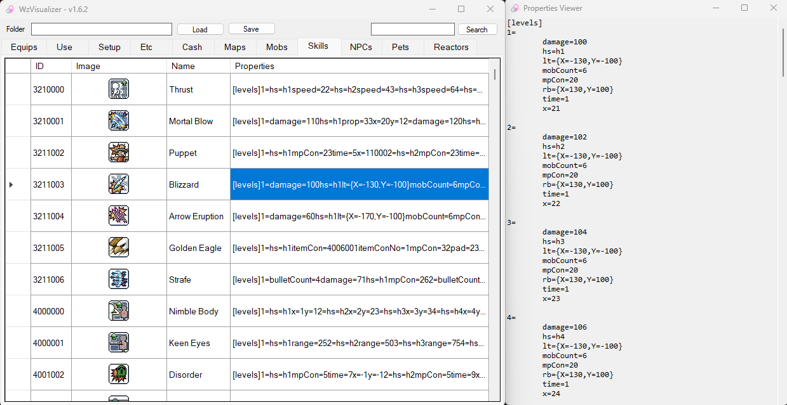

# WzVisualizer
A MapleStory .wz visualizer written in C#  
Also known as a GM Handtool!  

# Features
- Each cell automatically have their contents copied to the clipboard
    - Click and drag to select cells, rows and/or columns and use `CTRL+C` to copy
    - Also works for images!

- Double click the ID column to copy an !item command (mainly useful for private servers)

- Saves data into binary files allowing for faster startup/load times as you no longer have to wait for .wz decryption

- Supports `.img` and `.wz` files

- Hold `SHIFT` when loading or saving to process all tabs (**Warning**: High memory usage!)

- Double click a `Properties` cell to view data  

- Double click an image to auto adjust column and row size to match the image

- Search box uses each word (separated by spaces) as indivudual search queries
